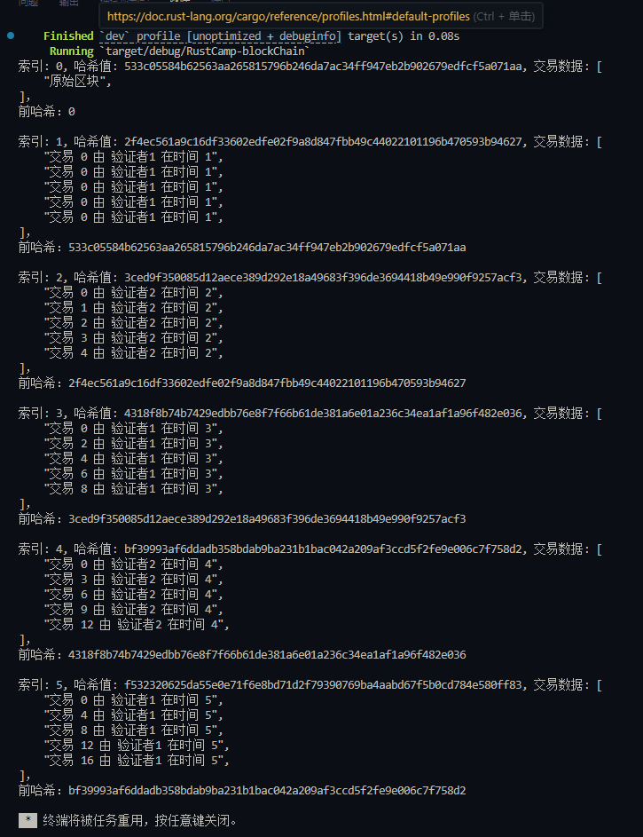

## 项目概述
### 项目地址：
https://opencamp.ai/Rust/camp/S01/stage/3

[产品方案](https://github.com/MrTwoc/RustCamp-Blockchain/blob/main/%E4%BA%A7%E5%93%81%E6%96%B9%E6%A1%88.pdf)
 

[技术方案](https://github.com/MrTwoc/RustCamp-Blockchain/blob/main/%E6%8A%80%E6%9C%AF%E6%96%B9%E6%A1%88.pdf)
# RustCamp-blockChain 项目说明

## 项目概述
本项目 RustCamp-blockChain 是一个用 Rust 语言开发的简单区块链实现，融合了 Proof of History (POH) 和 Delegated Proof of Stake (DPoS) 共识机制。项目使用 `chrono` 库处理时间戳，`sha3` 库进行哈希计算，`rand` 库处理随机数相关操作。

## 代码结构与功能模块

### 1. 区块（Block）
- **定义**：`Block` 结构体表示区块链中的单个区块，包含以下字段：
  - `block_index`：区块索引
  - `timestamp`：时间戳
  - `block_hash`：区块哈希
  - `leader`：领导节点
  - `_reward`：区块奖励
  - `transactions`：交易数据
  - `previous_hash`：前一个区块的哈希
- **方法**：
  - `calculate_hash`：根据区块的各项信息计算其哈希值。
  - `new`：创建一个新的区块实例，并自动计算其哈希值。

### 2. 区块链（Blockchain）
- **定义**：`Blockchain` 结构体包含一个 `Block` 类型的向量 `chain`，用于存储区块链中的所有区块。
- **方法**：
  - `new`：创建一个新的区块链实例，包含一个创世区块。
  - `get_latest_block`：获取区块链中的最后一个区块。
  - `add_block`：向区块链中添加一个新的区块。

### 3. 时间证明（POH）
- **定义**：`POH` 结构体包含一个 `counter`（计数器），用于记录事件的发生次数。
- **方法**：
  - `new`：创建一个新的 `POH` 实例。
  - `record_event`：记录一个事件，增加计数器的值并返回当前计数值。

### 4. 委托权益证明（DPoS）
- **定义**：`DPoS` 结构体包含一个 `validators`（验证者列表）和 `current_validator_index`（当前验证者索引）。
- **方法**：
  - `new`：创建一个新的 `DPoS` 实例。
  - `get_current_validator`：获取当前的验证者，并循环更新验证者索引。

## 主函数流程
在 `main` 函数中，程序执行以下操作：
1. 创建一个新的区块链实例。
2. 创建一个新的 `POH` 实例。
3. 创建一个新的 `DPoS` 实例，包含两个验证者。
4. 通过循环添加 5 个新的区块到区块链中，每个区块包含 5 笔交易。
5. 打印区块链中每个区块的信息，包括索引、哈希值、交易数据和前一个区块的哈希。

## 依赖项
项目的依赖项在 `Cargo.toml` 文件中定义，主要包括：
- `chrono`：用于处理时间戳，版本为 0.4，启用 `serde` 特性。
- `rand`：用于随机数生成，版本为 0.9.0。
- `sha3`：用于哈希计算，版本为 0.10.8。

## 运行截图
